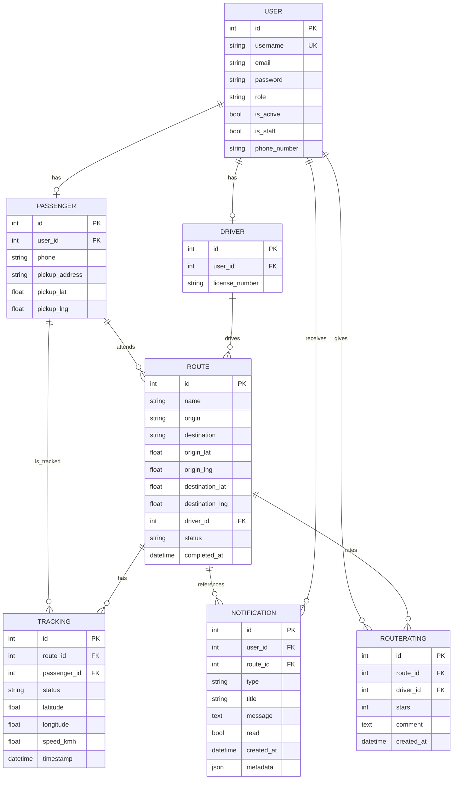

# Modelos de datos — Vialtros

> Última revisión: 23 de septiembre de 2026

Este proyecto usa Django con una base de datos relacional. Por defecto se configura SQLite para desarrollo local y puede usar PostgreSQL en producción mediante variables de entorno. La lógica principal de datos está en `backend/users/models.py` y la configuración de la base de datos en `backend/core/settings.py`.

---

## 1) Tipo de base de datos

El proyecto está diseñado para trabajar con:

- SQLite: valor por defecto en desarrollo, archivo `backend/db.sqlite3`
- PostgreSQL: opción recomendada para producción, configurada con `DB_ENGINE=django.db.backends.postgresql`

La configuración actual hace esto:

- Si no hay variables `DB_ENGINE`/`DB_HOST`, usa SQLite.
- Si existen variables de PostgreSQL, usa PostgreSQL con SSL habilitado.

Esto se define en `backend/core/settings.py` con `DATABASES` y `AUTH_USER_MODEL = 'users.User'`.

---

## 2) Modelo general de datos

La base de datos tiene una estructura orientada a transporte escolar o de rutas compartidas con usuarios, conductores, pasajeros y seguimiento GPS.



---

## 3) Entidades y campos principales

### 3.1 User

Es el modelo principal de autenticación de Django.

- Hereda de `AbstractUser`
- Se usa como modelo de usuario global del sistema
- Se configura en `AUTH_USER_MODEL = 'users.User'`

Campos relevantes:

| Campo | Tipo | Descripción |
| --- | --- | --- |
| `id` | AutoField PK | Identificador único |
| `username` | CharField | Nombre de usuario único de Django |
| `email` | EmailField | Correo del usuario |
| `password` | CharField | Contraseña hasheada |
| `role` | CharField | Roles: `admin`, `driver`, `user` |
| `phone_number` | CharField | Teléfono adicional del usuario |
| `is_active` | BooleanField | Usuario activo/inactivo |
| `is_staff` | BooleanField | Acceso al panel admin |

Roles:

- `admin`: administración del sistema
- `driver`: conductor asignado a rutas
- `user`: pasajero/usuario regular

---

### 3.2 Driver

Representa la entidad conductor.

| Campo | Tipo | Descripción |
| --- | --- | --- |
| `id` | AutoField PK | Identificador del perfil |
| `user` | OneToOneField → User | Relación 1:1 con el usuario |
| `license_number` | CharField | Número de licencia de conducir |

Regla: un usuario con rol `driver` tiene un perfil de conductor.

---

### 3.3 Passenger

Representa la entidad pasajero.

| Campo | Tipo | Descripción |
| --- | --- | --- |
| `id` | AutoField PK | Identificador del perfil |
| `user` | OneToOneField → User | Relación 1:1 con el usuario |
| `phone` | CharField | Teléfono del pasajero |
| `pickup_address` | CharField | Dirección de recogida |
| `pickup_lat` | FloatField | Latitud de recogida |
| `pickup_lng` | FloatField | Longitud de recogida |

Se usa para registrar el punto de recogida de cada pasajero.

---

### 3.4 Route

Representa una ruta o recorrido asignado a un conductor con varios pasajeros.

| Campo | Tipo | Descripción |
| --- | --- | --- |
| `id` | AutoField PK | Identificador de la ruta |
| `name` | CharField | Nombre de la ruta |
| `origin` | CharField | Punto de origen |
| `destination` | CharField | Punto de destino |
| `origin_lat` | FloatField | Latitud del origen |
| `origin_lng` | FloatField | Longitud del origen |
| `destination_lat` | FloatField | Latitud del destino |
| `destination_lng` | FloatField | Longitud del destino |
| `driver` | ForeignKey → Driver | Conductor asignado, nullable |
| `passengers` | ManyToManyField → Passenger | Pasajeros asociados |
| `status` | CharField | `pending` o `completed` |
| `completed_at` | DateTimeField | Fecha de finalización |

Relaciones clave:

- `Route` pertenece a un `Driver` (muchas rutas por conductor)
- `Route` tiene muchos `Passenger` mediante `ManyToMany`
- `Route` puede tener varios registros de seguimiento `Tracking`

---

### 3.5 PickupStatus / Tracking

`PickupStatus` es una enumeración de estados para el seguimiento del pasajero.

Valores:

- `picked`: recogido
- `not_picked`: no recogido
- `dropped_off`: dejado en parada

`Tracking` almacena el estado GPS del pasajero durante una ruta:

| Campo | Tipo | Descripción |
| --- | --- | --- |
| `id` | AutoField PK | Identificador del evento |
| `route` | ForeignKey → Route | Ruta asociada |
| `passenger` | ForeignKey → Passenger | Pasajero asociado |
| `status` | CharField | Estado de recogida |
| `latitude` | FloatField | Latitud actual |
| `longitude` | FloatField | Longitud actual |
| `speed_kmh` | FloatField | Velocidad estimada |
| `timestamp` | DateTimeField | Fecha y hora del punto GPS |

Índices:

- `['route', '-timestamp']` para consultas por ruta y tiempo

Esto permite búsquedas eficientes para tracking en tiempo real.

---

### 3.6 Notification

Sistema de notificaciones para usuarios.

| Campo | Tipo | Descripción |
| --- | --- | --- |
| `id` | AutoField PK | Identificador |
| `user` | ForeignKey → User | Destinatario |
| `type` | CharField | Tipo de notificación |
| `title` | CharField | Título |
| `message` | TextField | Mensaje |
| `route` | ForeignKey → Route | Ruta asociada (opcional) |
| `read` | BooleanField | Leída/no leída |
| `created_at` | DateTimeField | Fecha de creación |
| `metadata` | JSONField | Datos extra del evento |

Tipos de notificación definidos:

- `route_started`
- `student_picked_up`
- `student_dropped_off`
- `approaching_stop`
- `approaching_destination`
- `driver_near_stop`
- `driver_near_destination`
- `message_from_user`

Índices:

- `['user', 'read', 'created_at']`
- orden por `-created_at`

---

### 3.7 RouteRating

Calificación que recibe un conductor al finalizar una ruta.

| Campo | Tipo | Descripción |
| --- | --- | --- |
| `id` | AutoField PK | Identificador |
| `route` | ForeignKey → Route | Ruta evaluada |
| `driver` | ForeignKey → User | Usuario conductor evaluado |
| `stars` | PositiveSmallIntegerField | Valor de 1 a 5 |
| `comment` | TextField | Comentario opcional |
| `created_at` | DateTimeField | Fecha creación |

Restricciones:

- `stars` validado entre 1 y 5
- `unique_together = [('route', 'driver')]`

---

### 3.8 PasswordResetToken

Tokens para recuperación de contraseña.

| Campo | Tipo | Descripción |
| --- | --- | --- |
| `id` | AutoField PK | Identificador |
| `user` | ForeignKey → User | Usuario que solicita recuperación |
| `token` | CharField | Token único |
| `created_at` | DateTimeField | Fecha generación |
| `used` | BooleanField | Si ya se usó |

Tiene lógica de validez:

- Válido solo si no está usado
- Expira en 1 hora (`3600` segundos)

---

## 4) Relaciones prácticas

### Usuarios y perfiles

- `User` es la entidad principal.
- `Driver` y `Passenger` son perfiles adicionales de usuarios.
- Ambos son `OneToOneField` a `User`, por lo que cada usuario solo puede tener un perfil activo de ese tipo.

### Rutas y pasajeros

- Una ruta puede tener varios pasajeros.
- Un pasajero puede estar en varias rutas a lo largo del tiempo.
- La relación se resuelve con una tabla intermedia generada por Django (`Route_passengers`).

### Tracking GPS

- Cada punto GPS se registra en `Tracking`.
- Un registro está asociado a una ruta y a un pasajero.
- Esto permite ver el movimiento de cada pasajero en tiempo real o histórico.

### Notificaciones

- Cada notificación va dirigida a un usuario concreto.
- Puede estar asociada a una ruta y guardar metadata JSON para datos contextuales.

---

## 5) Consideraciones técnicas de la base de datos

### Motor actual

- Desarrollo local: SQLite
- Producción recomendada: PostgreSQL

La configuración del proyecto soporta ambos, pero la base de datos real en ambiente local es `backend/db.sqlite3`.

### Seguridad y autenticación

- Se usa `AbstractUser` con un `User` custom
- La autenticación está basada en JWT (`rest_framework_simplejwt`)
- `AUTHENTICATION_BACKENDS` usa un backend insensible a mayúsculas/minúsculas

### WebSockets y tracking

El proyecto usa Channels y Redis o memoria local para eventos en tiempo real. Las posiciones GPS se registran en la base de datos y luego pueden ser consumidas por WebSockets.

---

## 6) Instrucciones para trabajar con la base de datos

### Crear migraciones

```bash
cd backend
python manage.py makemigrations
```

### Aplicar migraciones

```bash
cd backend
python manage.py migrate
```

### Ver estado de migraciones

```bash
cd backend
python manage.py showmigrations
```

### Abrir shell de Django

```bash
cd backend
python manage.py shell
```

### Inspeccionar modelos

```bash
cd backend
python manage.py inspectdb
```

### Limpiar base de datos local (solo desarrollo)

```bash
cd backend
python manage.py flush
```

> Cuidado: esto elimina los datos de desarrollo y no es recomendable en producción.

### Uso con PostgreSQL

En producción, normalmente se configuran estas variables de entorno:

```bash
DB_ENGINE=django.db.backends.postgresql
DB_NAME=neondb
DB_USER=usuario
DB_PASSWORD=secret
DB_HOST=host
DB_PORT=5432
```

Luego se ejecutan:

```bash
python manage.py migrate
```

---

## 7) Recomendaciones para mantenimiento

1. Usar PostgreSQL en producción en lugar de SQLite.
2. Mantener índices en `Tracking` y `Notification` para consultas frecuentes.
3. Revisar periódicamente la limpieza de tokens de recuperación.
4. Guardar datos sensibles como contraseñas solo mediante Django hash.
5. Para pruebas, usar datos de ejemplo aislados y no mezclar con producción.

---

## 8) Resumen corto

La base de datos del proyecto está centrada en tres conceptos principales:

- `User`: identidad y autenticación
- `Driver` / `Passenger`: perfiles de roles
- `Route` + `Tracking`: gestión y seguimiento de recorrido

Además, el sistema incluye:

- notificaciones
- calificaciones de rutas
- recuperación de contraseñas
- almacenamiento de puntos GPS y estado de recogida

Esta estructura permite un flujo completo de administración, seguimiento, comunicación y monitoreo de rutas en tiempo real.
